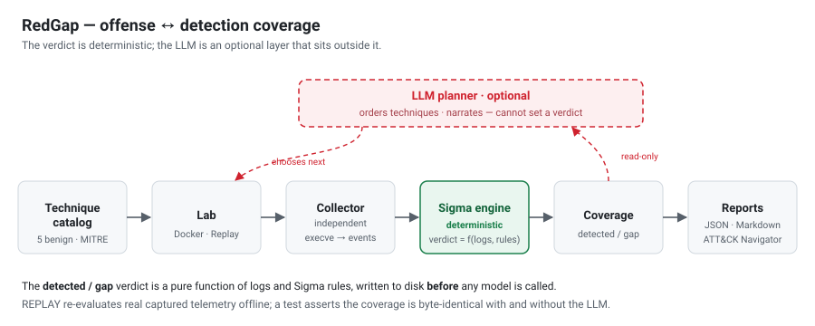

# Architecture

RedGap runs a small set of benign, MITRE ATT&CK-mapped techniques against a disposable
lab, collects real process-execution telemetry with an **independent** collector, and
decides - deterministically, from logs and Sigma rules - whether each technique was
*detected* or is a *gap*.

## The trust boundary

The single load-bearing property is that the `detected` verdict is a **pure function of
`(events, rules)`**, computed and written to disk **before** any language model is
called. The optional LLM planner may choose the order of techniques and narrate the
report; it drives the same validated tool executor the deterministic planner uses and
**cannot** produce or change a verdict. `tests/test_planner.py` asserts the coverage is
byte-identical with and without the LLM - even when the model finishes early, runs a
subset, or requests a technique that does not exist.

## The pieces

| Component | File | Role |
|-----------|------|------|
| Technique catalog | `src/redgap/catalog.py`, `techniques/catalog_data.py` | 51 benign techniques + their commands and cleanup |
| Lab | `lab/`, `src/redgap/lab.py` | Disposable Docker container + a ~40-line `LD_PRELOAD` execve collector |
| Target | `src/redgap/target.py` | `ReplayTarget` (committed real fixtures, offline) / `LiveDockerTarget` |
| Telemetry | `src/redgap/telemetry/` | snoopy-format parser → SigmaHQ `process_creation` events |
| Detection | `src/redgap/detection/` | pySigma parser + RedGap's own AST evaluator; coverage join |
| Planner | `src/redgap/planner.py` | Heuristic (default) / LLM (optional), one `ToolExecutor` |
| Report | `src/redgap/report/` | `coverage.json`, `coverage.md`, ATT&CK Navigator layer |

## Two modes, one engine

- **REPLAY** (default): re-evaluate committed real-telemetry fixtures. Offline, no key,
  no Docker - what CI runs and what a reviewer reproduces in one command.
- **LIVE** (`--live`): bring up the Docker lab, execute the techniques, capture fresh
  telemetry, and run the **same** engine.

Fixtures are verbatim captures with `provenance.json` (sha256, kernel, image id, exact
commands, timestamp) and are regenerable via `redgap capture`; the nightly LIVE CI job
re-captures on a clean runner so the fixtures are auditable, not hand-authored.
